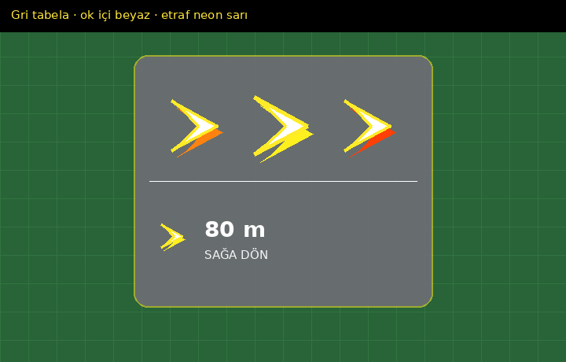
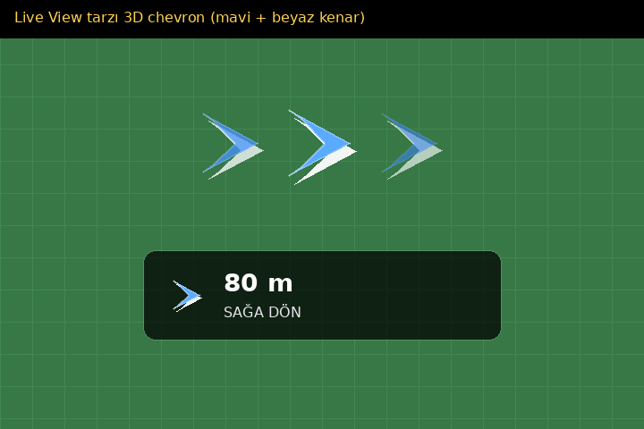
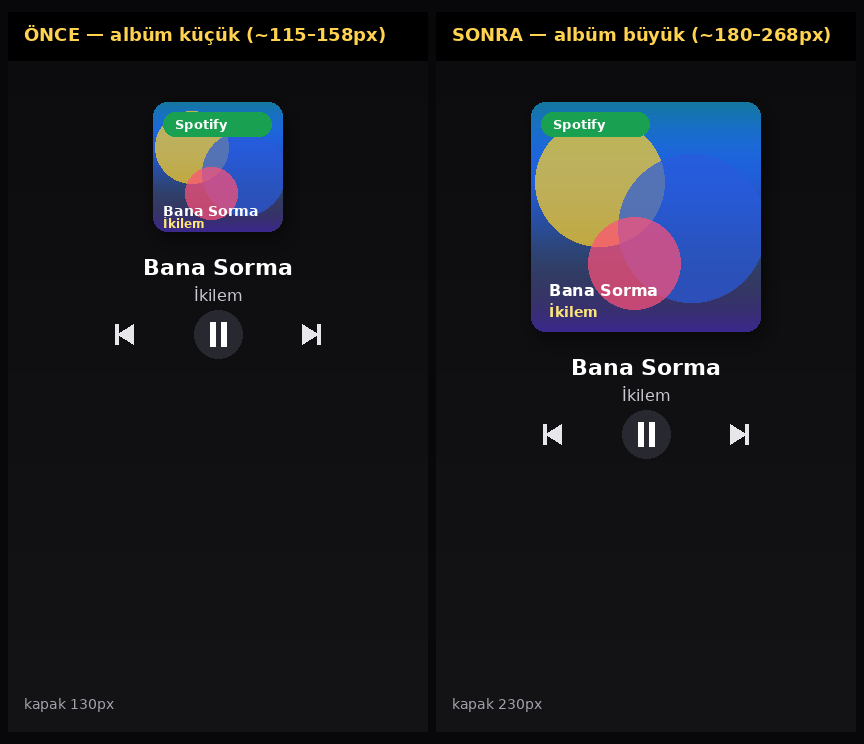
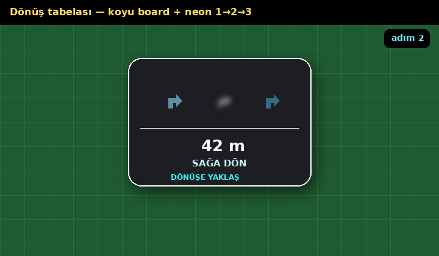
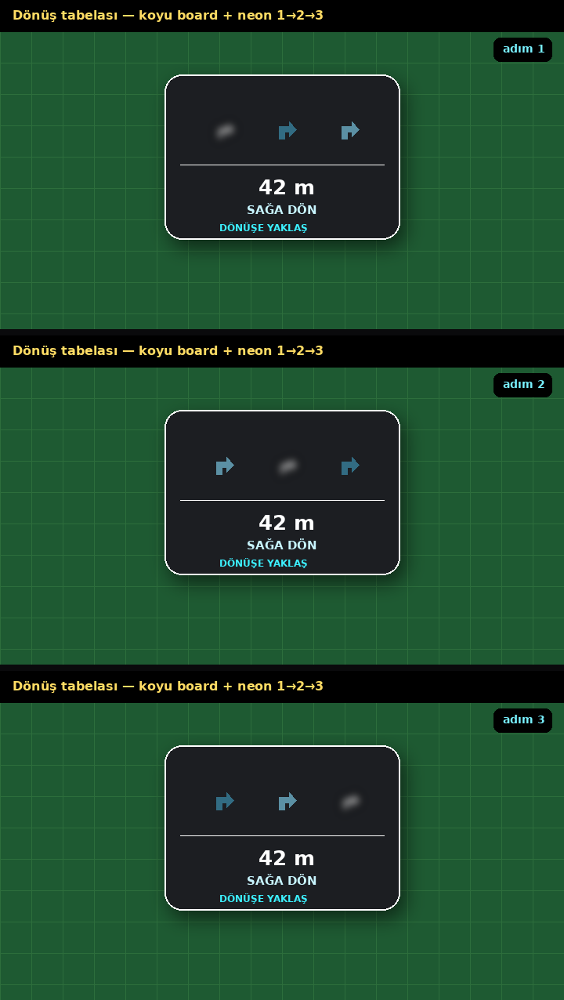
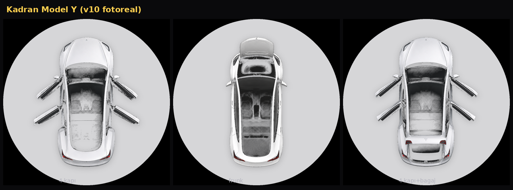
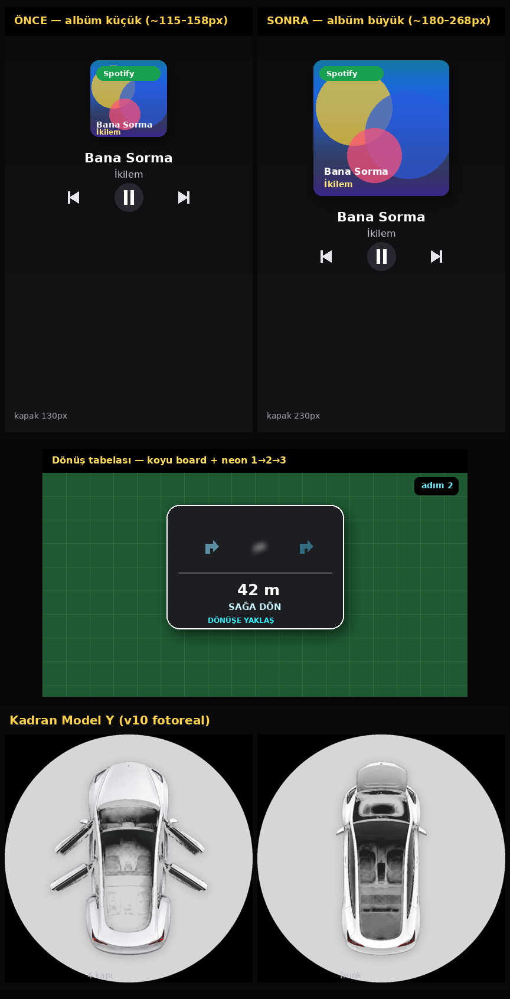

# Pulse28 HUD UI (xcode-ble-91)

## Dönüş — gri tabela, beyaz ok, neon sarı kenar

# Pulse28 HUD UI önizleme (xcode-ble-90)

## Dönüş — Google Live View 3D chevron

# Pulse28 HUD UI önizleme (xcode-ble-90)

## Albüm boyutu (önce / sonra)

## Dönüş tabelası

## Chase 1→2→3

## Kadran Model Y v10

## Hepsi

