# Dönüş işareti — 10 örnek

Beğendiğin **numarayı** yaz (1–10).

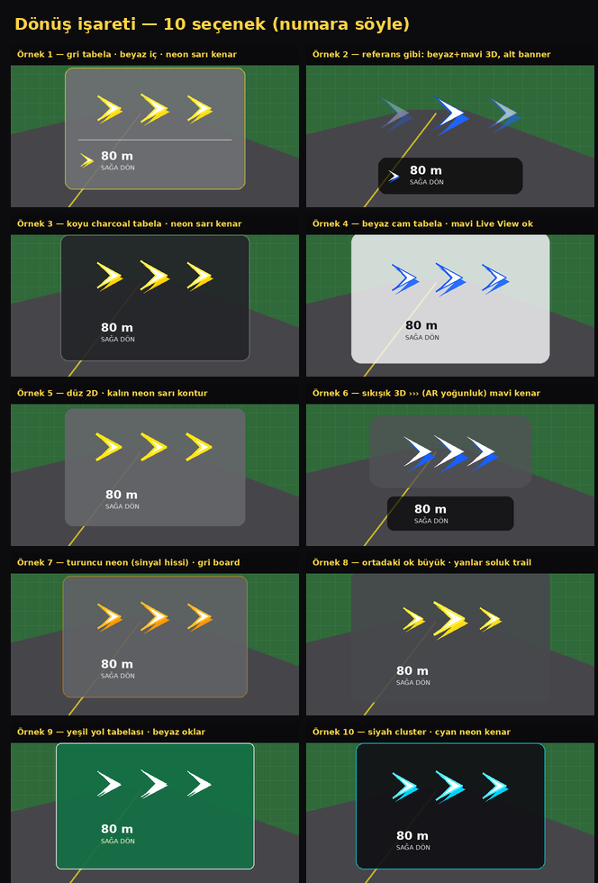

## 1) gri + beyaz + neon sarı

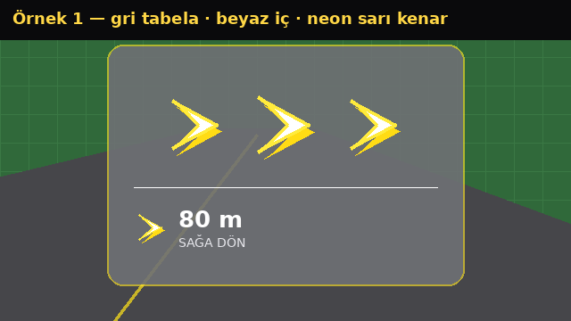

## 2) referans: beyaz + mavi 3D

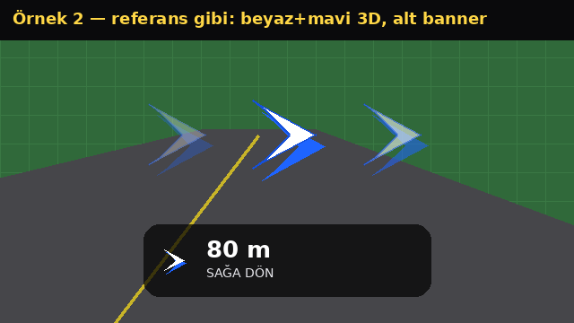

## 3) charcoal + neon sarı

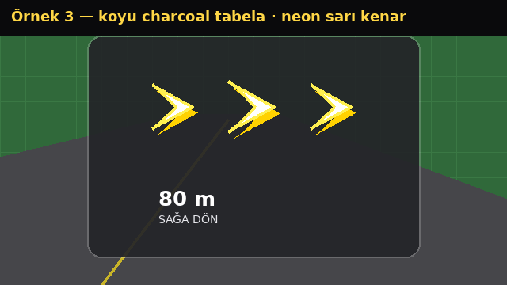

## 4) beyaz cam + mavi

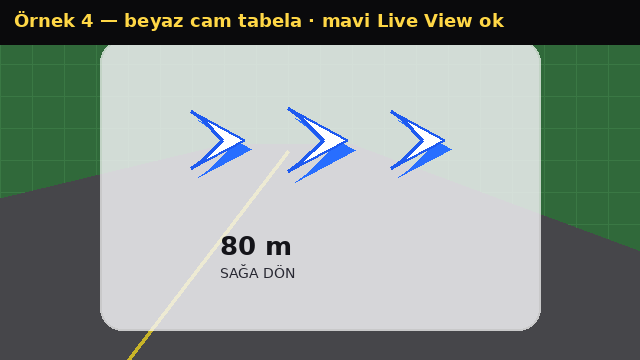

## 5) 2D kalın sarı kontur

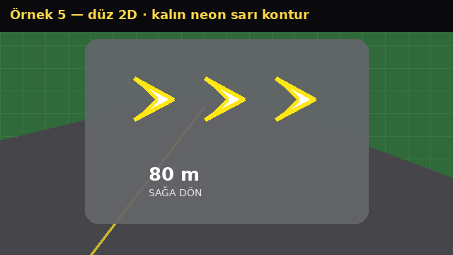

## 6) sıkışık AR mavi

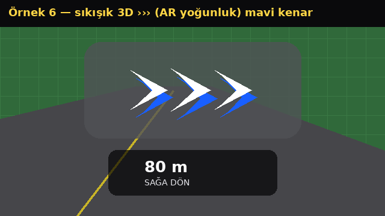

## 7) turuncu sinyal

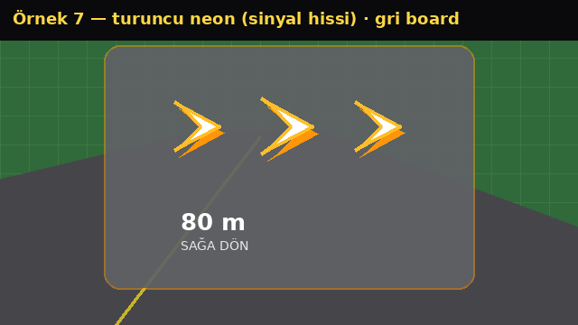

## 8) büyük orta ok

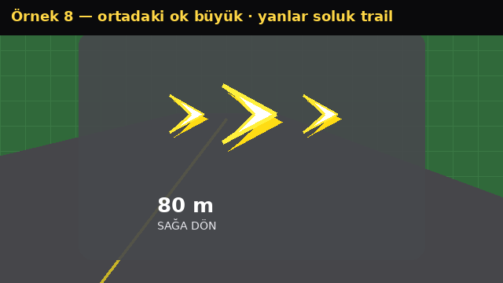

## 9) yeşil yol tabelası

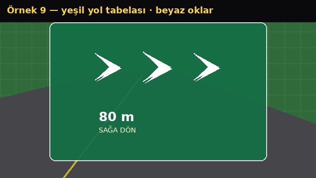

## 10) siyah + cyan

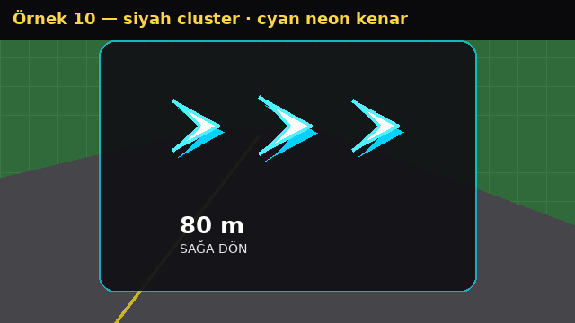
